# Blockchain Verification & Tamper Detection System

## Overview

VendorChain implements a robust blockchain verification system that ensures data integrity between Odoo ERP and the Hyperledger Fabric blockchain. This system detects any unauthorized modifications to contract data and provides real-time alerts when tampering is detected.

## Key Features

### 1. Data Integrity Verification
- **Real-time Hash Comparison**: Every contract's critical data is hashed and compared with blockchain records
- **Immutable Audit Trail**: All legitimate changes are recorded on blockchain with unique transaction IDs
- **Tamper Detection**: Unauthorized modifications are detected through hash mismatches

### 2. Verification Methods

#### Manual Verification
- **Per-Contract Verification**: Click "Verify Blockchain" button on any contract
- **Instant Results**: Immediate feedback on data integrity status
- **Visual Indicators**: Color-coded badges show verification status

#### Automated Verification
- **Hourly Integrity Checks**: Cron job verifies all active contracts every hour
- **Tamper Detection**: Every 30 minutes, checks for recently modified contracts
- **Email Alerts**: Administrators receive alerts when mismatches are detected

#### Command-Line Verification
```bash
# Interactive verification menu
./scripts/verify-blockchain-data.sh

# Python blockchain explorer
python3 scripts/blockchain-explorer.py verify -c CONTRACT2024001

# Check blockchain statistics
python3 scripts/blockchain-explorer.py stats
```

## Verification Status Indicators

### In Odoo UI

| Status | Badge Color | Meaning |
|--------|------------|---------|
| ✅ Verified | Green | Data matches blockchain exactly |
| ⚠️ Data Mismatch | Yellow/Orange | Data has been modified outside workflow |
| ❌ Not on Blockchain | Red | Contract not found on blockchain |
| ⏳ Verification Pending | Gray | Verification in progress |

### Blockchain Fields

- **Blockchain Transaction ID**: Unique identifier for each blockchain operation
- **Blockchain Hash**: SHA-256 hash of contract data for comparison
- **Blockchain Verified**: Boolean indicator of verification status
- **Last Verification Date**: Timestamp of most recent verification
- **Verification Status**: Current verification state

## How It Works

### 1. Data Hashing
When a contract is created or modified through proper workflow:
```python
data_to_hash = {
    'contract_id': contract.contract_id,
    'vendor_id': contract.vendor_id.vendor_id,
    'contract_type': contract.contract_type,
    'description': contract.description,
    'total_value': contract.total_value,
    'expiry_date': contract.expiry_date,
    'state': contract.state
}
blockchain_hash = sha256(json.dumps(data_to_hash, sort_keys=True))
```

### 2. Blockchain Sync
Every workflow action generates a blockchain transaction:
- **CREATE**: Contract creation → Blockchain TX
- **VERIFY**: Verification action → Blockchain TX
- **SUBMIT**: Submission action → Blockchain TX
- **PAYMENT**: Payment recording → Blockchain TX

### 3. Verification Process

```mermaid
graph TD
    A[Contract Data in Odoo] --> B[Compute Current Hash]
    B --> C[Retrieve Blockchain Data]
    C --> D{Compare Data}
    D -->|Match| E[✅ Verified]
    D -->|Mismatch| F[⚠️ Tamper Detected]
    D -->|Not Found| G[❌ Not on Chain]
    F --> H[Create Security Alert]
    F --> I[Send Email to Admins]
```


## Security Alerts

### When Tampering is Detected

1. **Immediate Actions**:
   - Log security warning with contract details
   - Create activity/task for investigation
   - Update verification status in UI

2. **Notifications**:
   - Email sent to all administrators
   - In-app notification with sticky warning
   - Activity created for follow-up

3. **Alert Content**:
   ```
   🚨 SECURITY ALERT
   Contract CONTRACT2024001 has been modified outside of the normal workflow.
   Modified by: John Doe
   Modified at: 2024-01-10 14:23:45
   The data no longer matches the blockchain record.
   Immediate investigation required!
   ```

## Scheduled Jobs (Cron)

### 1. Hourly Integrity Check
- **Name**: `cron_verify_blockchain_integrity`
- **Frequency**: Every hour
- **Purpose**: Verify all active contracts against blockchain
- **Actions**: Check data integrity, create alerts for mismatches

### 2. Tamper Detection
- **Name**: `cron_detect_tampered_data`
- **Frequency**: Every 30 minutes
- **Purpose**: Detect recent unauthorized modifications
- **Actions**: Check recently modified contracts, create security alerts

### 3. Expired Contract Check
- **Name**: `cron_check_expired_contracts`
- **Frequency**: Daily
- **Purpose**: Mark expired contracts
- **Actions**: Update contract status, send notifications

## Testing Tamper Detection

### Demo Script
Run the tamper detection demonstration:
```bash
python3 scripts/test-tamper-detection.py
```

This script will:
1. Create a new contract (synced to blockchain)
2. Verify initial blockchain sync
3. Simulate data tampering (direct DB modification)
4. Run verification to detect tampering
5. Show security alerts created

### Manual Testing

1. **Create a Contract**:
   - Navigate to Vendor Contracts → Contracts
   - Create new contract
   - Note the blockchain TX ID

2. **Modify Data Improperly**:
   - Use database tools to directly modify contract value
   - Or use API to bypass workflow

3. **Verify Integrity**:
   - Click "Verify Blockchain" button
   - Observe "Data Mismatch" status
   - Check Activities for security alert

## Best Practices

### For Administrators

1. **Regular Monitoring**:
   - Review verification status dashboard weekly
   - Investigate all "Data Mismatch" alerts immediately
   - Keep audit logs of investigations

2. **Access Control**:
   - Limit database access to authorized personnel
   - Use role-based permissions in Odoo
   - Monitor user activities

3. **Incident Response**:
   - Document all tampering incidents
   - Identify root cause
   - Implement additional controls if needed

### For Developers

1. **Always Use Workflow**:
   - Never modify contract data directly in database
   - Use proper Odoo methods and workflows
   - Ensure all changes generate blockchain transactions

2. **Testing**:
   - Test verification after any contract modifications
   - Verify cron jobs are running properly
   - Monitor logs for verification errors

## Troubleshooting

### Common Issues

1. **"Not on Blockchain" Status**:
   - **Cause**: Contract created but blockchain sync failed
   - **Solution**: Click "Sync to Blockchain" button
   - **Prevention**: Ensure API gateway is running

2. **"Data Mismatch" After Legitimate Change**:
   - **Cause**: Change made without blockchain sync
   - **Solution**: Re-sync through proper workflow
   - **Prevention**: Always use workflow actions

3. **Verification Timeout**:
   - **Cause**: Blockchain node not responding
   - **Solution**: Check Fabric peer status
   - **Prevention**: Monitor blockchain health

### Logs and Debugging

Check logs for verification details:
```bash
# Odoo logs
docker logs vendorchain-odoo | grep "verification"

# Check for security alerts
docker logs vendorchain-odoo | grep "SECURITY"

# View cron job execution
docker logs vendorchain-odoo | grep "cron"
```

## Recovery Procedures

### If Tampering is Detected

1. **Immediate Actions**:
   - Document the incident
   - Identify affected contracts
   - Determine scope of tampering

2. **Investigation**:
   - Check audit logs for unauthorized access
   - Review user activities
   - Identify tampering method

3. **Recovery Options**:
   - **Restore from Blockchain**: Revert data to match blockchain
   - **Re-sync**: Process through proper workflow
   - **Manual Correction**: Fix data and document changes

4. **Prevention**:
   - Strengthen access controls
   - Increase monitoring frequency
   - Add additional verification layers

## Technical Architecture

### Components

1. **Odoo Models**:
   - `blockchain_hash`: Computed field for data integrity
   - `verification_status`: Current verification state
   - `_verify_blockchain_data()`: Core verification method

2. **Blockchain Integration**:
   - CouchDB: Blockchain state database
   - Fabric Peer: Transaction processing
   - API Gateway: Bridge between Odoo and Fabric

3. **Verification Flow**:
   ```
   Odoo → Compute Hash → Query Blockchain → Compare Data → Update Status → Alert if Mismatch
   ```

## Security Considerations

### Data Protected

- Contract ID and basic info
- Vendor relationships
- Financial values
- Contract state/workflow
- Payment history

### Not Protected

- Internal notes (not on blockchain)
- Attachments (stored separately)
- UI preferences
- Computed fields

## Conclusion

The blockchain verification system provides robust protection against unauthorized data modifications in VendorChain. By combining real-time verification, automated monitoring, and comprehensive alerting, the system ensures that contract data remains trustworthy and tamper-evident.

For questions or issues, consult the logs or run the verification scripts for detailed diagnostics.